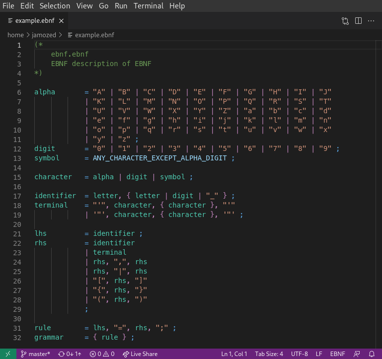

# EBNF for Visual Studio Code

> EBNF syntax highlighting for Visual Studio Code.

## About

EBNF for Visual Studio Code provides EBNF syntax highlihting for Visual Studio
Code. Files with the extension `.ebnf` will automatically be affected.

## Meta

Copyright (C) 2020, Jakob Wakeling  
All rights reserved.  
[OMKOV Permissive Licence](https://www.omkov.net/OLPE)
